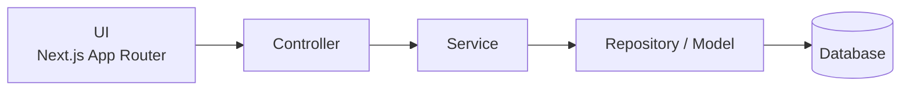

# meuDinheiroNaMao

Aplicação web de **controle financeiro pessoal** construída como um **monólito fullstack único**, responsivo **mobile-first**, com frontend e backend no mesmo app e arquitetura em camadas:

`UI -> Controller -> Service -> Repository/Model -> Database`

O produto cobre desde o MVP três contextos funcionais separados:

- **financeiro real**
- **investimentos**
- **simulações isoladas**

> O foco principal continua sendo o **controle financeiro pessoal**, mas já com cobertura de **patrimônio/investimentos** desde o MVP e com **simulações separadas dos dados reais**.

---

## Visão do produto

O **meuDinheiroNaMao** nasce para centralizar a vida financeira pessoal em um único sistema, organizado em três domínios funcionais complementares.

### 1. Controle financeiro real
Responsável pelo acompanhamento do dia a dia financeiro:

- receitas
- despesas
- transferências
- custos fixos e variáveis
- contas financeiras
- saldo e visão consolidada do período

### 2. Investimentos
Responsável pela visão patrimonial e pelos movimentos de investimento:

- aportes
- posições por ativo, classe ou categoria
- evolução patrimonial
- visão consolidada de patrimônio
- agregações específicas de investimento

### 3. Simulações
Responsável por cenários hipotéticos e projeções sem afetar a base real:

- cenários isolados
- projeções financeiras
- comparação entre estratégias
- testes de fluxo futuro
- análises sem contaminar o histórico real

---

## Princípios e contratos do produto

### Arquitetura oficial do sistema

`UI -> Controller -> Service -> Repository/Model -> Database`

### Separação funcional obrigatória

O sistema deve manter separação explícita entre:

- **dados reais**
- **investimentos**
- **simulações**

### Regra de IA

A IA:

- interpreta dados consolidados
- apoia insights e explicações
- **não cria verdade primária**
- **não substitui a regra de negócio**

### Regra do Client Service

O **Client Service**:

- é uma expansão futura
- fica **fora do núcleo inicial do MVP**
- entra como **origem de captura**, não como regra central do sistema

---

## Arquitetura oficial

O projeto está oficialmente definido como um **monólito fullstack único**, implementado com **Next.js fullstack + App Router**, mantendo frontend e backend no mesmo projeto e separação lógica interna por camadas.

### Camadas do monólito

#### UI
- coleta entrada do usuário
- renderiza telas, formulários, listas, dashboards e gráficos
- trata estados de loading, vazio, erro e sucesso
- prioriza experiência responsiva mobile-first

#### Controller
- recebe requests da UI
- valida entrada
- orquestra request/response
- encaminha o fluxo para os services corretos

#### Service
- aplica regra de negócio
- calcula métricas e agregações
- separa fluxos de financeiro real, investimentos e simulações
- prepara dados para dashboards, relatórios e IA

#### Repository / Model
- define estruturas e contratos do domínio
- organiza acesso à persistência
- encapsula leitura e escrita no banco

#### Database
- armazena dados transacionais e históricos
- preserva integridade entre contextos
- sustenta consultas, agregações e auditoria de dados

### Decisão arquitetural fechada

- **Modelo do sistema:** monólito fullstack
- **Framework principal:** Next.js com App Router
- **Sem ambiguidade de backend:** não há alternativa aberta entre Next.js API e NestJS
- **Separação interna:** por camadas e por módulos de domínio dentro do mesmo app

---

## Módulos e domínios do monólito

O sistema será organizado conceitualmente em quatro módulos principais:

### `finance`
- transações reais
- contas financeiras
- categorias e subcategorias
- saldo e consolidação operacional
- dashboard financeiro

### `investments`
- aportes
- ativos
- posições
- evolução patrimonial
- visão consolidada de patrimônio

### `simulations`
- cenários hipotéticos
- projeções
- comparações
- resultados isolados do real

### `shared`
- autenticação
- usuários
- componentes compartilhados
- utilitários
- contratos comuns
- integrações transversais

---

## Fluxo de responsabilidade por camada

Cada requisição deve seguir o seguinte fluxo de responsabilidade:

1. **UI** coleta entrada e renderiza a saída
2. **Controller** valida e orquestra request/response
3. **Service** aplica a regra de negócio
4. **Repository** acessa a persistência
5. **Model** define a estrutura e os contratos do domínio
6. **Database** armazena e recupera os dados

---

## Separação de persistência por contexto

A modelagem conceitual deve manter separação clara de persistência entre os contextos abaixo:

### Contexto `real`
- transações financeiras reais
- contas reais
- categorias reais
- métricas operacionais e saldo

### Contexto `investment`
- aportes
- posições
- movimentações patrimoniais
- consolidação e evolução da carteira

### Contexto `simulation`
- cenários hipotéticos
- parâmetros informados pelo usuário
- projeções calculadas
- comparações de resultado

### Regras obrigatórias
- **simulações não viram transações reais**
- **simulações não contaminam saldo, patrimônio real ou dashboards operacionais**
- **investimentos têm fluxo próprio e agregações próprias**
- **investimento não deve ser tratado como despesa comum por padrão**

---

## Escopo do MVP

O MVP já inclui os três domínios do produto, com foco principal em financeiro pessoal e cobertura inicial de patrimônio e cenários.

### Funcionalidades do MVP
- cadastro manual de transações
- contas financeiras
- categorias e subcategorias
- dashboard
- importação
- revisão
- insights
- **módulo básico de investimentos**
- **módulo de simulações já no MVP, mas isolado do real**

### Regras importantes do MVP
- **simulações não viram transações reais**
- **investimentos possuem fluxo e agregações próprios**
- **dados reais, investimentos e simulações permanecem separados por contexto**
- o **Sankey** continua como uma **visão avançada**, não como requisito central da primeira entrega

### Visualizações previstas
- resumo financeiro do período
- gastos por categoria
- evolução de saldo
- comparação entre receitas e despesas
- visão consolidada de patrimônio
- evolução de investimentos
- cenários simulados lado a lado
- Sankey financeiro como visualização avançada

---

## Experiência do produto

### Direção de UX
- **mobile-first**
- responsivo para celular, tablet e desktop
- foco em clareza, rapidez e baixo esforço cognitivo
- ações principais visíveis: adicionar, importar, revisar e analisar
- maior densidade de informação no desktop para leitura analítica

### Uso por plataforma
- **mobile:** lançamento rápido, consulta, revisão e leitura de resumo
- **desktop:** análise detalhada, filtros, gráficos, patrimônio e simulações

---

## Papel da IA

A IA será usada para:

- resumir períodos financeiros
- identificar padrões e tendências
- sugerir insights sobre comportamento financeiro e patrimonial
- explicar dados já consolidados pelo sistema
- apoiar geração de textos analíticos para dashboards

### Contrato da IA
- recebe dados estruturados pelo sistema
- não inventa transações
- não cria saldo fictício
- não altera a verdade primária do sistema
- depende de dados consolidados por regras explícitas da aplicação

---

## Client Service futuro

O projeto já deve nascer preparado para uma futura integração com um **Client Service local** no computador do usuário.

Esse componente poderá, no futuro:

- rodar em background
- capturar dados brutos localmente
- apoiar automações assistidas
- servir como origem adicional de importação e revisão

### Regra de integração

O **Client Service** será tratado como **origem externa de captura**, e não como o centro da regra de negócio do produto.

---

## Fora do escopo inicial

- automação bancária complexa como fluxo principal
- scraping bancário como núcleo do MVP
- decisões automáticas sem revisão humana
- criação automática de verdade financeira pela IA
- dependência do Client Service para operação básica do sistema

---

## Diagramas

### Atores e casos de uso

```mermaid
flowchart LR
    U[Usuário]
    IA[Serviço de IA]
    CS[Client Service Futuro]

    UC1[Registrar transações reais]
    UC2[Importar dados]
    UC3[Revisar lançamentos]
    UC4[Gerenciar investimentos]
    UC5[Criar simulações]
    UC6[Visualizar dashboard]
    UC7[Visualizar Sankey e gráficos avançados]
    UC8[Receber insights]

    U --> UC1
    U --> UC2
    U --> UC3
    U --> UC4
    U --> UC5
    U --> UC6
    U --> UC7
    U --> UC8

    IA -. interpreta dados consolidados .-> UC8
    CS -. origem futura de captura .-> UC2
```



### Arquitetura em camadas



### Módulos do sistema

```mermaid
flowchart TD
    APP[Monólito Fullstack Carteira]

    APP --> F[Financeiro Real]
    APP --> I[Investimentos]
    APP --> SIM[Simulações]
    APP --> AI[IA]
    APP --> CS[Client Service Futuro]
    APP --> SH[Shared]

    F --> F1[Receitas, despesas e transferências]
    F --> F2[Contas, categorias e dashboard]

    I --> I1[Aportes e posições]
    I --> I2[Evolução patrimonial]

    SIM --> S1[Cenários isolados]
    SIM --> S2[Projeções e comparações]
```



### Fluxo de dados por contexto

```mermaid
flowchart TD
    E[Entrada do usuário]

    E --> T1[Transação real]
    E --> T2[Dado de investimento]
    E --> T3[Cenário simulado]

    T1 --> FS[Finance Service]
    T2 --> IS[Investment Service]
    T3 --> SS[Simulation Service]

    FS --> DB1[(Persistência real)]
    IS --> DB2[(Persistência investment)]
    SS --> DB3[(Persistência simulation)]

    DB1 --> D1[Dashboard financeiro]
    DB2 --> D2[Visão patrimonial]
    DB3 --> D3[Visão de cenários]

    DB1 -. dados consolidados .-> IA2[Camada de IA]
    DB2 -. dados consolidados .-> IA2
    IA2 -. insights interpretativos .-> D1
    IA2 -. insights interpretativos .-> D2
```



---

## Stack definida

A stack oficial do projeto fica fixada em:

- **Next.js**
- **TypeScript**
- **Tailwind CSS**
- **PostgreSQL**
- **Prisma**
- **Recharts / Nivo**
- **OpenAI API**

---

## Execução local com Docker

Para subir a aplicação e o banco com um único comando:

```bash
docker compose up --build
```

Depois disso:

- aplicação: `http://localhost:3000`
- PostgreSQL: `localhost:5432`

### Acesso pelo celular na mesma rede

O endereço `0.0.0.0` **não é um link de navegação**; ele apenas indica que o servidor está escutando em todas as interfaces da máquina host.

Para abrir no celular, use o **IPv4 local do computador** na mesma rede Wi-Fi. Exemplo:

```bash
http://SEU_IP_LOCAL:3000/finance
```

Exemplo real de uso:

```bash
http://10.10.10.93:3000/finance
```

> O celular e o computador precisam estar na **mesma rede**, e a porta `3000` precisa estar liberada no firewall local.

### IP mostrado no log do Docker

O banner do container usa a variável abaixo para mostrar a URL de rede correta:

```bash
APP_PUBLIC_URL="http://10.10.10.93:3000"
```

Se o IP da sua máquina mudar, atualize essa variável no `.env` e rode novamente:

```bash
docker compose up --build
```

### Comportamento do container da aplicação

Ao subir com Docker, o serviço da aplicação:

1. aguarda o PostgreSQL ficar saudável
2. aplica as migrations do Prisma
3. executa o seed idempotente do usuário demo
4. inicia o Next.js em `0.0.0.0:3000`

---

## Roadmap

### 1. Base monolítica + autenticação + financeiro real
- estrutura do monólito fullstack
- autenticação
- arquitetura em camadas
- módulo de financeiro real

### 2. Importação + revisão
- importação de extratos e arquivos
- normalização de entrada
- deduplicação assistida
- revisão manual

### 3. Investimentos
- cadastro de aportes
- ativos e posições
- visão patrimonial consolidada

### 4. Simulações isoladas
- criação de cenários
- projeções
- comparações sem afetar dados reais

### 5. Insights e visualizações avançadas
- insights com IA
- gráficos avançados
- Sankey financeiro

### 6. Client Service futuro
- client service local
- captura assistida
- novas origens de dados externas ao núcleo inicial

---

## Resumo executivo

O **Carteira** está definido como um **monólito fullstack único**, responsivo **mobile-first**, implementado com **Next.js + TypeScript + Tailwind + PostgreSQL + Prisma**, seguindo a arquitetura oficial:

`UI -> Controller -> Service -> Repository/Model -> Database`

O produto separa formalmente três contextos de negócio:

- **financeiro real**
- **investimentos**
- **simulações isoladas**

A IA atua como camada interpretativa sobre dados consolidados, e o **Client Service** permanece como expansão futura, fora do núcleo inicial do MVP.
