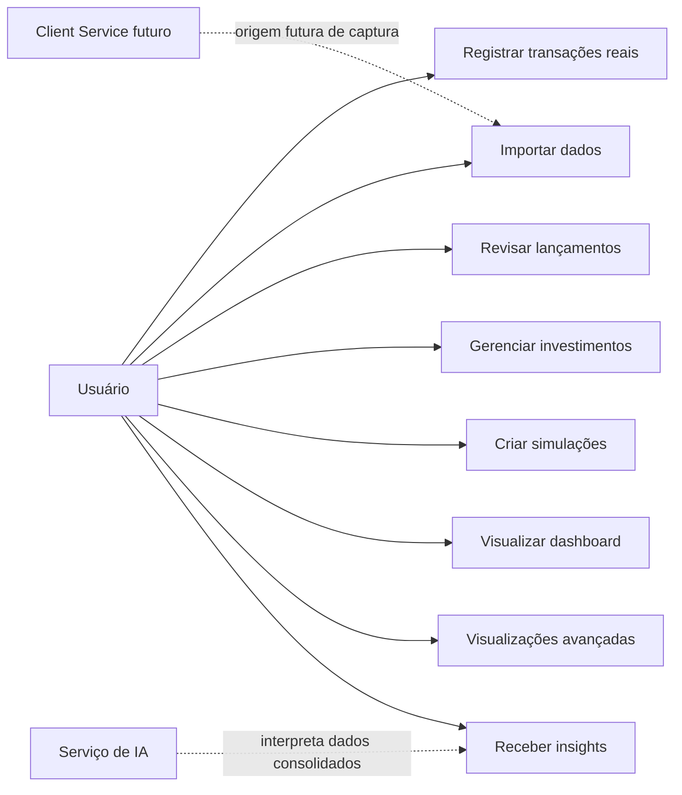
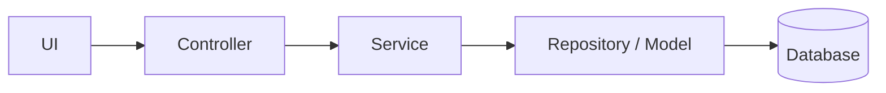
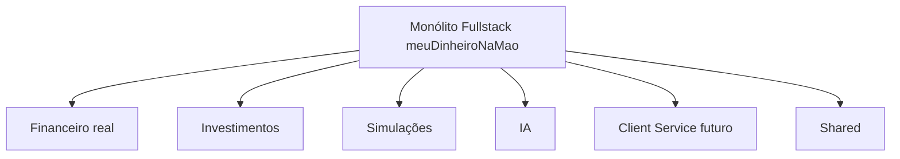
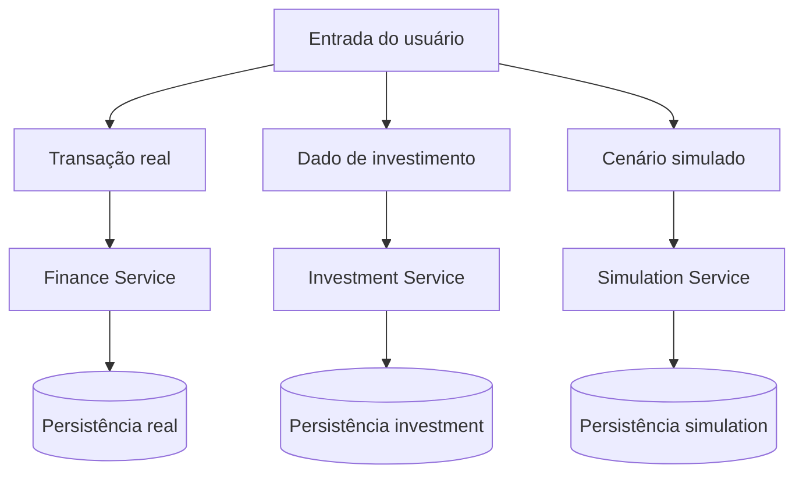

# meuDinheiroNaMao

Aplicação web de **controle financeiro pessoal** construída como um **monólito fullstack único**, responsivo **mobile-first**, com frontend e backend no mesmo app e arquitetura em camadas:

`UI -> Controller -> Service -> Repository/Model -> Database`

O produto cobre desde o MVP três contextos funcionais separados:

- **financeiro real**
- **investimentos**
- **simulações isoladas**

> O foco principal continua sendo o controle financeiro pessoal, mas com cobertura de patrimônio/investimentos desde o MVP e com simulações sempre separadas dos dados reais.

---

## Visão do produto

O **meuDinheiroNaMao** centraliza a vida financeira pessoal em um único sistema, organizado em três domínios funcionais complementares.

### 1. Controle financeiro real
- receitas
- despesas
- transferências
- custos fixos e variáveis
- contas financeiras
- saldo e visão consolidada do período

### 2. Investimentos
- aportes
- posições por ativo, classe ou categoria
- evolução patrimonial
- visão consolidada do patrimônio
- agregações específicas de investimento

### 3. Simulações
- cenários isolados
- projeções financeiras
- comparação entre estratégias
- testes de fluxo futuro
- análises sem contaminar o histórico real

---

## Princípios e contratos

### Arquitetura oficial

`UI -> Controller -> Service -> Repository/Model -> Database`

### Separação funcional obrigatória

O sistema mantém separação explícita entre:

- **dados reais**
- **investimentos**
- **simulações**

### Regra de IA

A IA:

- interpreta dados consolidados
- apoia insights e explicações
- **não cria verdade primária**
- **não substitui a regra de negócio**

### Regra do Client Service

O **Client Service**:

- é uma expansão futura
- fica fora do núcleo inicial do MVP
- entra como origem de captura, não como regra central do sistema

---

## Arquitetura do monólito

O projeto está oficialmente definido como um **monólito fullstack** implementado com **Next.js fullstack + App Router**, mantendo frontend e backend no mesmo projeto e separação lógica por camadas.

### Camadas

#### UI
- coleta entrada do usuário
- renderiza telas, formulários, listas, dashboards e gráficos
- trata estados de loading, vazio, erro e sucesso
- prioriza experiência responsiva mobile-first

#### Controller
- recebe requests da UI
- valida entrada
- orquestra request/response
- encaminha o fluxo para os services corretos

#### Service
- aplica regra de negócio
- calcula métricas e agregações
- separa fluxos de financeiro real, investimentos e simulações
- prepara dados para dashboards, relatórios e IA

#### Repository / Model
- define estruturas e contratos do domínio
- organiza acesso à persistência
- encapsula leitura e escrita no banco

#### Database
- armazena dados transacionais e históricos
- preserva integridade entre contextos
- sustenta consultas, agregações e auditoria de dados

---

## Módulos do sistema

### `finance`
- transações reais
- contas financeiras
- categorias e subcategorias
- saldo e consolidação operacional
- dashboard financeiro

### `investments`
- aportes
- ativos
- posições
- evolução patrimonial
- visão consolidada do patrimônio

### `simulations`
- cenários hipotéticos
- projeções
- comparações
- resultados isolados do real

### `shared`
- autenticação
- usuários
- componentes compartilhados
- utilitários
- contratos comuns

---

## Fluxo de responsabilidade

1. **UI** coleta entrada e renderiza a saída
2. **Controller** valida e orquestra request/response
3. **Service** aplica a regra de negócio
4. **Repository** acessa a persistência
5. **Model** define a estrutura e os contratos do domínio
6. **Database** armazena e recupera os dados

---

## Persistência por contexto

### Contexto `real`
- transações financeiras reais
- contas reais
- categorias reais
- métricas operacionais e saldo

### Contexto `investment`
- aportes
- posições
- movimentações patrimoniais
- consolidação e evolução da carteira

### Contexto `simulation`
- cenários hipotéticos
- parâmetros informados pelo usuário
- projeções calculadas
- comparações de resultado

### Regras obrigatórias
- **simulações não viram transações reais**
- **simulações não contaminam saldo, patrimônio real ou dashboards operacionais**
- **investimentos têm fluxo próprio e agregações próprias**
- **investimento não deve ser tratado como despesa comum por padrão**

---

## MVP atual

O MVP já inclui os três domínios do produto, com foco principal em financeiro pessoal e cobertura inicial de patrimônio e cenários.

- cadastro manual de transações
- contas financeiras
- categorias e subcategorias
- dashboard
- importação
- revisão
- insights
- **módulo básico de investimentos**
- **módulo de simulações já no MVP, mas isolado do real**

### Regras do MVP
- **simulações não viram transações reais**
- **investimentos possuem fluxo e agregações próprios**
- **dados reais, investimentos e simulações permanecem separados por contexto**
- o **Sankey** continua como visão avançada

---

## Diagramas

### Atores e casos de uso



### Arquitetura em camadas



### Módulos do sistema



### Fluxo de dados por contexto



---

## Stack definida

- **Next.js**
- **TypeScript**
- **Tailwind CSS**
- **PostgreSQL**
- **Prisma**
- **Recharts / Nivo**
- **OpenAI API**

---

## Execução local com Docker

Para subir a aplicação e o banco com um único comando:

```bash
docker compose up --build
```

Depois disso:

- aplicação: `http://localhost:3000`
- PostgreSQL: `localhost:5432`

### Acesso pelo celular na mesma rede

O endereço `0.0.0.0` **não é um link de navegação**. Para abrir no celular, use o **IPv4 local do computador** na mesma rede Wi-Fi.

Exemplo:

```bash
http://10.10.10.93:3000/finance
```

> O celular e o computador precisam estar na mesma rede e a porta `3000` precisa estar liberada no firewall local.

### IP mostrado no log do Docker

O banner do container usa a variável abaixo para mostrar a URL de rede correta:

```bash
APP_PUBLIC_URL="http://10.10.10.93:3000"
```

Se o IP da sua máquina mudar, atualize essa variável no `.env` e rode novamente:

```bash
docker compose up --build
```

### Comportamento do container

Ao subir com Docker, o serviço da aplicação:

1. aguarda o PostgreSQL ficar saudável
2. aplica as migrations do Prisma
3. executa o seed idempotente do usuário demo
4. inicia o Next.js em `0.0.0.0:3000`

---

## Roadmap

1. **base monolítica + autenticação + financeiro real**
2. **importação + revisão**
3. **investimentos**
4. **simulações isoladas**
5. **insights e visualizações avançadas**
6. **client service futuro**

---

## Resumo executivo

O **meuDinheiroNaMao** está definido como um **monólito fullstack único**, responsivo **mobile-first**, implementado com **Next.js + TypeScript + Tailwind + PostgreSQL + Prisma**, seguindo a arquitetura oficial:

`UI -> Controller -> Service -> Repository/Model -> Database`

O produto separa formalmente três contextos de negócio:

- **financeiro real**
- **investimentos**
- **simulações isoladas**

A IA atua como camada interpretativa sobre dados consolidados, e o **Client Service** permanece como expansão futura, fora do núcleo inicial do MVP.
